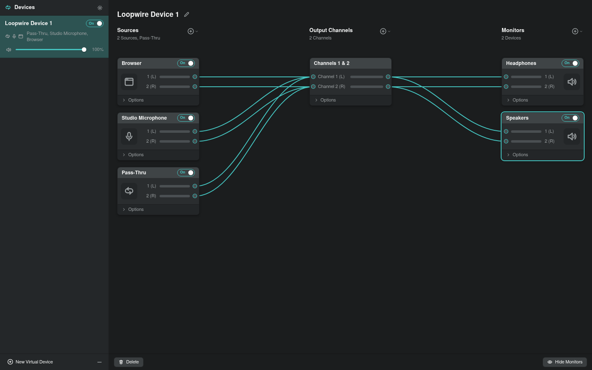

# Loopwire

Loopwire is a Linux virtual audio routing app for PipeWire-first desktops.



Loopwire gives you named virtual devices with sources, output buses, monitor targets, and guarded backend apply
transactions. It keeps capability limits visible instead of pretending the host audio graph succeeded.

## Install

Current contributor path:

```bash
git clone https://github.com/sandwichfarm/loopwire
cd loopwire
pnpm install
pnpm check
```

The curl installer is release-gated until signed public artifacts and Bunny deployment exist.

Version tags are handled by the protected GitHub Release workflow, which publishes portable tarballs, AppImages,
verified native packages, signed checksums, and a machine-readable asset inventory. No public release exists yet.

## Basic usage

1. Launch the desktop shell with `pnpm --filter @loopwire/desktop dev`.
2. Create a new virtual device in the sidebar.
3. Add sources, an output bus, and a monitor target from the `+` menus.
4. Drag routes between ports and let Loopwire preview or apply the selected backend safely.

The default device starts as Pass-Thru -> Channels 1 & 2, so the first route is already visible.

## Guides

- [Install guide](https://loopwire.app/docs/guide/install.html)
- [Basic usage / first route](https://loopwire.app/docs/guide/basic-usage.html)
- [Configurations](https://loopwire.app/docs/guide/configurations.html)
- [Audio backends](https://loopwire.app/docs/guide/backends.html)
- [Start on boot](https://loopwire.app/docs/guide/start-on-boot.html)
- [Support matrix](https://loopwire.app/docs/guide/support-matrix.html)
- [Troubleshooting](https://loopwire.app/docs/guide/troubleshooting.html)
- [Developer architecture](https://loopwire.app/docs/developer/architecture.html)

## Status

Loopwire is pre-release. PipeWire is the first-class path; PulseAudio and JACK have explicit compatibility limits, and
ALSA is detection-only. See the [support matrix](https://loopwire.app/docs/guide/support-matrix.html) before relying on
host apply. The curl installer remains release-gated until signed public artifacts are published and smoke-tested.

## Development

```bash
pnpm check
pnpm build:web
```

Release operators: [configure GitHub Actions variables and secrets](https://loopwire.app/docs/developer/github-actions-setup.html).
